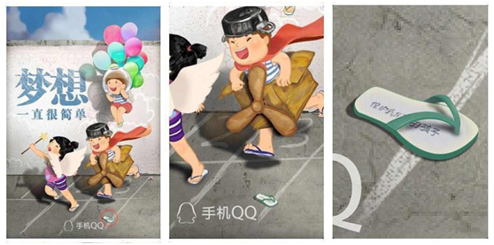
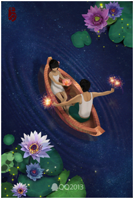
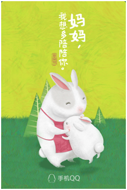
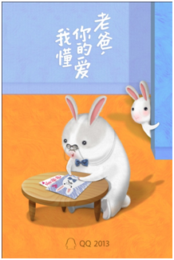
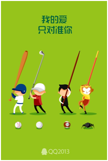
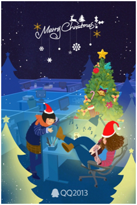
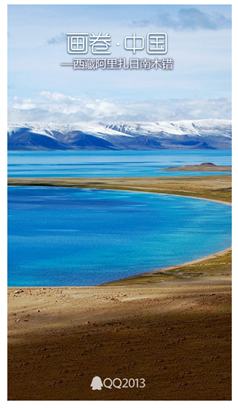

# QQ 的登录封面（QQ印象）是怎么设计的？

**话题**: 腾讯 QQ, 用户体验设计, 封面设计

    author:      傅仲 (鹅厂)
    upvote:      1812 赞同
    count:       3916 字
    create_date: 2014-01-10
    edit_date:   2014-01-13
    fetch_date:  2015-07-24
    link:        http://www.zhihu.com/question/22497026/answer/21551914/

用户量越多，产品登录封面的设计越难做，因为需要照顾到更多的人群。QQ是个多终端产品，在手机端和电脑端都有日登录数亿的用户。为QQ这样一艘巨舰做运营策划，压力，一定是有的。

运营节点的选择很重要，大家经常会在节日的日子里看到QQ的特别cover。节日的时候，大多数人的情绪和想法会无限趋近，作品更容易引起大家心中的共鸣。其次，是热点事件的随时关注和即时跟踪。第三个是一些系列性的策划，这些策划通常会有比较长的策划周期。

举2013年的一些例子和大家分享一下。

**六一 细节中的关怀**

世界或许复杂，梦想却依然简单。

在很多人看来，六一儿童节已经不是一个简单的儿童节，是童年礼，不管我们多大，都在提醒我们保持内心的一份童真。画面里的彩色气球、玻璃鱼缸、飞行纸箱，都是童心乐的元素。

还有一只拖鞋。

在这张画面的下方，有一只孩子玩耍时掉下来的拖鞋，放大了看，拖鞋里有一行文案：保护我们的孩子。

在六一前的时候，有越来越多的关于儿童安全问题的讨论，一连串的“校长案”，让人愤怒而痛心。我们可以为此做些什么？在策划的时候，我们希望通过一些细节的处理，能够去唤起人们心中的那股力量，呼吁人们给予儿童安全方面更多的关注。这是这只拖鞋里隐藏的信息的由来。

在这个图出来以后，有一些用户网友评论说，可不可以这样理解，这只鞋子是不是代表了国家所谓的提倡保护未成年人，而且用这种走走就掉的人字拖来形容这种保护是非常脆弱和形同虚设的。

这个含义，我们就真的是没有想到了。

**高考 平心静气**

平心静气”是在高考期间策划发布的。画面中的小人站在清澈的水面上，面对海阔天空，风轻云淡。高考是学子人生大事，QQ当然希望这个时候能给大家加油鼓劲，平心静气。但就像后来许多用户借用来抒发情感所表达的那样，我们一开始想表达的不仅局限于高考，其实人生的每一次际遇，我们都应不慌不忙，练就从容面对的智慧。无论是埋首在学业的繁重，还是下班后投身于拥挤人群，无论是受尽委屈后的难过哭泣，还是面对着际遇的波折，我们都希望，大家能够有一种能让自己平静下来的能力。

如果你有看到这幅画感到一丝宁静，享受这舒缓的一刻吧，把它留在心底。

**七夕 情人的静谧**

这是为数不多的没有文案的封面。在喧哗的七夕热度中，QQ希望用最原始的质朴去呈现爱情最初始的悸动，为大家保留一份静谧。画面上选取了七夕放灯的场景，加以现代情侣身着白衣的演绎，爱情的悸动在2人间悄悄蔓延。

你说要撑开那星空斑斓，长篙荡漾了那星座的旖旎。

你说要去到那银河的浩瀚，莲叶泛出了含语的细意。

你说你存下数亿光年的相思，只为这一时、这一刻的与我相依。

就让这夜静谧，静谧，这一岁的七夕。”

**父母亲节 萌兔表爱意**

中国人在表达爱上总是含蓄的。还记得这个可爱的兔子吗？父亲节、母亲节都是它代言。父亲节和母亲节怎么表达爱？洞察人心，只有抓住了用户内心的诉求点，找准了痛点，才有可能打动用户。都是说亲情，可母亲和父亲给人的感觉是决然不一样。大部分父亲都不善言辞，爱在心中口难开，我们怎会不知道？那么我们表达爱也婉转点吧，给他画幅画吧，看看他收到孩子亲自制作的礼物的开心表情。画面虽然稚嫩，可是是满满的心意。对妈妈的爱意就来得更直接点，都说子女是母亲的贴心棉袄，陪在她身边应该是最开心的事情吧。母亲节的cover我们看到《快乐大本营》的主持吴昕也截了图发在自己的微博。

对了，你一定在问为什么用兔子？因为我们的设计师，她喜欢兔子^_^

**光棍节 最后一位亮了**

光棍节的QQ封面创意被枪毙了很多稿（说多了都是泪&gt;_&lt;）。光棍节在中国已经是一个调侃取乐的节日，太感情路线是否不容易产生共鸣？最后的关头，设计师突然灵光一闪，选取了几个典型的拿棍棒职业群体造型，对准他们的目标。最调侃的是最后孙悟空拿着金箍棒，对准蜘蛛精，目标锁定对的人。画面配上文案：“我的爱只对准你”，表达了单身却依然有态度，有追求，对爱专一的靠谱价值观。画面文案相得益彰，调侃的同时给大家带来欢乐。

**圣诞节 红海中的蓝**

你有没有觉得这是一张风格迥异的圣诞节QQ封面？圣诞节在国外是个大型的节假日，在国内更多是给自己生活加乐的一个欢快理由。我们希望在这个圣诞依然工作的日子里，即使大家工作再忙也要记得放松休息片刻，在工作中寻找乐趣，工作与生活找到平衡。最后我们选择了办公人在工作休息之余弹唱吉他，与大家分享欢乐的场景。深夜的办公室，我们不断拿着道具摆拍各种造型以便设计师绘画参考。

在铺天盖地圣诞老人、圣诞礼物一片红的喜庆圣诞氛围中，QQ独树一帜的办公人群关怀有了独特的视角落点，红海中杀出一片蓝！在前面方案被秒毙的情况下，幕后团队经过一天一夜的通宵赶工，最后紧要关头硬是拼出来了新的QQ封面方案，最终戏剧性的审核通过了。此次创意又获得了很多好评，给了大家带来了新的感动。

**热气球旅行 用梦想致意世界**

这是我们选题上的一次尝新，纪念人类第一次热气球旅行。不曾跌倒过的青春不足丰盛，不曾为梦奔跑的日子黯淡无光。趁着还是年轻的心，为梦奔跑吧，即使不断跌倒，那也是一路的华丽。永远不要怀疑一群人的信仰，事实上世界就是被这样坚定的一小群人所改变！这是我们希望给到用户的一丝正能量。用行动践行心中的理想，用梦想致意世界。

**画卷中国 沉淀中国之美**

还记得QQ上刮起的画卷风吗？没时间出门看的美景，QQ封面为你呈现，足不出户，领略各地美景。你一定也想过让自己的家乡美景上QQ，与亿万用户分享家乡美吧？项目发布后，我们收集到了海量来自QQ用户、摄影师等多个渠道的投稿，我们从中选取了部分优秀作品展示。好评和赞扬也让我们欢欣鼓舞。QQ封面走出了自己的框框，很好的完成了一次与QQ海量用户的互动！小小的窗口，开放的视界。

回过头来可以看到，六一的儿童安全，高考的浮燥，七夕的喧杂，父母亲节中国人的含蓄，光棍节单身的目标、网络时代足不出户怎么看世界等等，都是策划的出发点。

**来说说我们自己**

是怎样的一群人在做QQ封面？

我们中的她，桌面凌乱不堪入目，但依然保持工作的高效和对创意的无限热情，享受一个人旅行的独来独往！

我们中的她，喜欢弹uklele，总是顶着一个二十几年一成不变的蘑菇头造型出入办公室，在夸张的造型中炫耀每一次对生活的热爱！

我们中的她，热爱美食，吃货祖母级，弱小的身材能够吃掉一整只鸡，对于熬夜加班和自恋拍照乐此不疲！

我们中的他，才华横溢，喜欢文学和运动，性格中的冷静沉着常常成为团队争吵的冷静剂。

对我们来说，它是QQ一直用心经营的一个伊甸园，我们不断为之倾入热情与能量。如果有那么一刻，在某一个时间，某一段记忆里，QQ封面有幸成为用户感动的一部分，那么在那一刻，我们就和用户找到了共鸣^_^ （QQ Cover 创策组）

　　

### 评论

**祝风翔**: 80000805，qq号不错！   (33 赞)

**Jocleys** 回复 **祝风翔**: +1 

**卞轩晨** 回复 **祝风翔**: +2 

**man funky** 回复 **祝风翔**: ＋80000805 

　　

--------------
from: [http://www.zhihu.com/question/22497026/answer/21551914/]()
